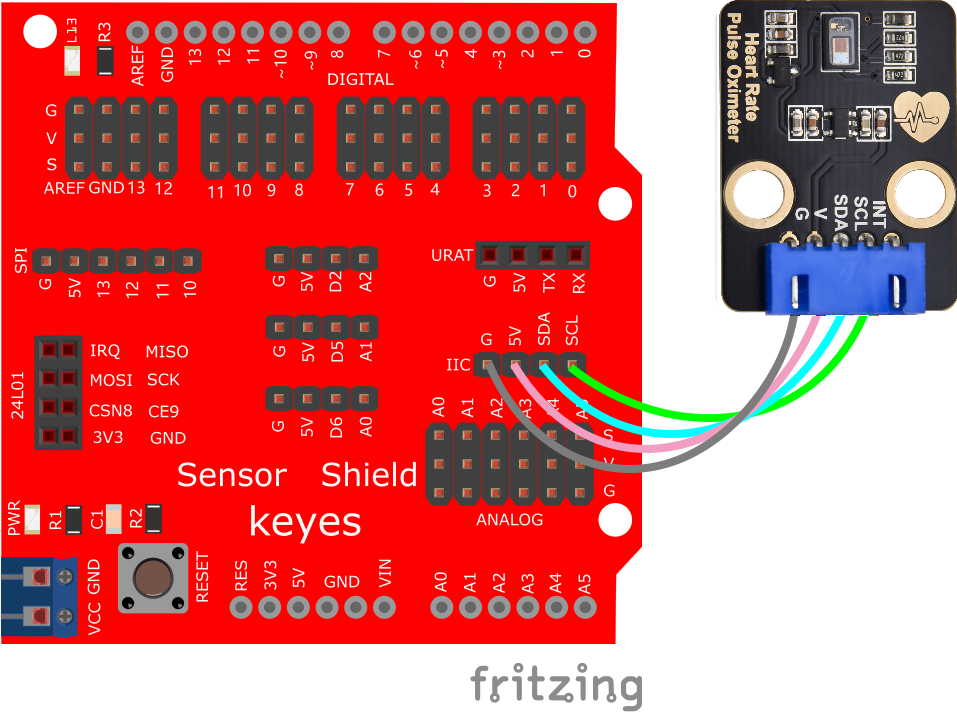
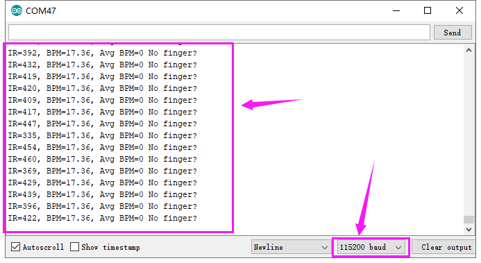
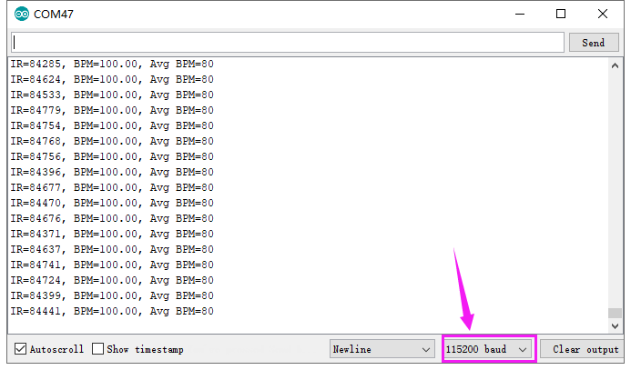

# Arduino

下载：[库文件](./库文件.7z)


## 1. Arduino简介  

Arduino是一种开源电子原型平台，旨在帮助爱好者和初学者轻松构建各种电子项目。Arduino结合了简单易用的硬件和软件，使得用户能够通过编写代码来控制和互动。基于微控制器的Arduino开发板允许用户连接各种传感器、执行器和显示设备，适用于智能家居、机器人、传感器网络等多个领域。  

Arduino使用简洁明了的编程语言（基于C/C++），不仅适合新手学习编程，也被经验丰富的开发者广泛应用。其强大的社区支持和丰富的文档使得用户能够快速上手，并解决项目中遇到的问题。很多学校和教育机构也将Arduino作为教学的一部分，培养学生的动手能力和创造性思维。  

## 2. 接线图  

  

## 3. 测试代码  

```cpp  
#include <Wire.h>  
#include "MAX30105.h"  
#include "heartRate.h"  

MAX30105 particleSensor;  

const byte RATE_SIZE = 4; // Increase this for more averaging. 4 is good.  
byte rates[RATE_SIZE]; // Array of heart rates  
byte rateSpot = 0;  
long lastBeat = 0; // Time at which the last beat occurred  
float beatsPerMinute;  
int beatAvg;  

void setup() {  
    Serial.begin(115200);  
    Serial.println("Initializing...");  

    // Initialize sensor  
    if (!particleSensor.begin(Wire, I2C_SPEED_FAST)) { // Use default I2C port, 400kHz speed  
        Serial.println("MAX30105 was not found. Please check wiring/power.");  
        while (1);  
    }  

    Serial.println("Place your index finger on the sensor with steady pressure.");  
    particleSensor.setup(); // Configure sensor with default settings  
    particleSensor.setPulseAmplitudeRed(0x0A); // Turn Red LED to low to indicate sensor is running  
    particleSensor.setPulseAmplitudeGreen(0); // Turn off Green LED  
}  

void loop() {  
    long irValue = particleSensor.getIR();  

    if (checkForBeat(irValue) == true) {  
        // We sensed a beat!  
        long delta = millis() - lastBeat;  
        lastBeat = millis();  
        beatsPerMinute = 60 / (delta / 1000.0);  

        if (beatsPerMinute < 255 && beatsPerMinute > 20) {  
            rates[rateSpot++] = (byte)beatsPerMinute; // Store this reading in the array  
            rateSpot %= RATE_SIZE; // Wrap variable  

            // Take average of readings  
            beatAvg = 0;  
            for (byte x = 0; x < RATE_SIZE; x++) {  
                beatAvg += rates[x];  
            }  
            beatAvg /= RATE_SIZE;  
        }  
    }  

    Serial.print("IR=");  
    Serial.print(irValue);  
    Serial.print(", BPM=");  
    Serial.print(beatsPerMinute);  
    Serial.print(", Avg BPM=");  
    Serial.print(beatAvg);  
    if (irValue < 50000) {  
        Serial.print(" No finger?");  
    }  
    Serial.println();  
}  
```  

## 4. 代码说明  

特别注意：上传代码之前，必须将对应的库文件放置到安装Arduino IDE的库文件夹中。  

## 5. 测试结果  

按照接线图接线，上传测试代码成功，利用USB线上电后，打开串口监视器，设置波特率为115200，串口监视器显示如下图。  

  

- IR值为判断有无手指靠近的值（当手指没有靠近传感器时，IR值较小且显示“No finger?”。贴近传感器后IR值剧增，且待测试数据进入测试范围值后开始示数）。  
- BPM值为心率，Avg BPM值为血氧饱和度（Avg BPM）。血氧饱和度是75-100，心率（BPM）60-150。  

特别注意：  
测试前应先感应手指脉动，手指脉搏要完全贴合传感器15秒左右，才会显示稳定数据。若串口监视器无数据显示时，请挪动手指脉搏处以利于传感器感应，或按UNO上的复位键，直到获得较平稳的数据。  




