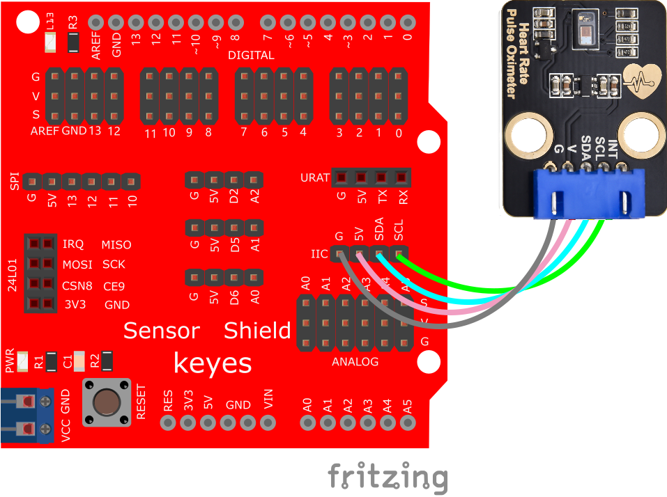
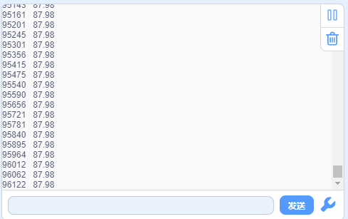

# KidsBlock

## 1. Kidsblock简介  

Kidsblock是一个图形化编程平台，旨在帮助初学者和年轻学生学习编程和电子技术。通过简单易用的拖放式界面，Kidsblock使得用户能够创建互动项目，而无需深入理解复杂的编程语法。它支持多种硬件，包括Arduino等开发板，适合进行各种教育项目和创意实验。  

Kidsblock包含丰富的学习资源，包括模块化编程元素和示例项目，帮助用户轻松上手。这个平台不仅适合儿童，还为新手提供了一个练习编程和动手能力的良好环境。Kidsblock的设计理念强调创造性学习，鼓励学生在互动和实践中掌握技术。  

## 2. 原理  

MAX30102是一套完整的脉搏血氧仪和心率传感器系统解决方案模块，专为可穿戴设备的要求而设计。该设备保持一个非常小的解决方案的大小，而不牺牲光学或电气性能。要集成到可穿戴系统中，需要最少的外部硬件组件。  

MAX30102完全可通过软件寄存器，数字输出数据可以存储在一个32-deep FIFO IC。FIFO允许MAX30102被连接到微控制器或处理器在一个共享的总线，数据没有被从MAX30102读取连续的寄存器。  

动脉血氧饱和度子系统  

MAX30102的SpO2子系统包含环境光取消(ALC)、持续时间的sigma-delta ADC和专有的离散时间过滤器。ALC有一个内部轨道/保持电路来取消环境光并增加有效的动态范围。动脉血氧饱和度ADC具有可编程的全面范围从2µa至16µa，酒精度可以取消200µa周围的电流。  

内部ADC是一个连续时间过采样的sigma-delta变换器，具有18位分辨率。ADC采样率为10.24MHz。ADC输出数据速率可以从50sps（每秒样本）到3200sps。  

  

## 3. 接线图  

  

## 4. 测试代码  

  

## 5. 测试结果  

按照接线图接线，上传测试代码成功，利用USB上电后，打开串口监视器，设置波特率为115200，将手指放在模块的感应处约一分钟，串口监视器显示的IR数值和每分钟的心跳数如下图所示：  

